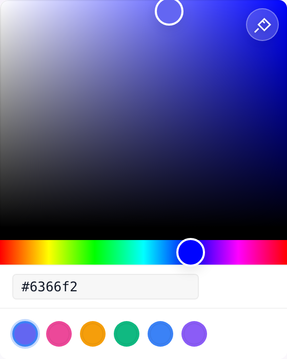

# vue3-colorful 🎨

<p align="center">
  <a href="https://www.npmjs.com/package/vue3-colorful"></a>
  <a href="https://github.com/edonfy/vue3-colorful/actions"></a>
  
  
</p>

<p align="center">
  <a href="https://edonfy.github.io/vue3-colorful/"><strong>Live Demo</strong></a>
</p>

Lightweight, accessible color pickers for Vue 3, built with TSX render functions and designed for app-level theming.

<p align="center">
  
</p>

---

## Quick Start

### Install

```bash
pnpm add vue3-colorful
```

If you use the popover component, install its peer dependency too:

```bash
pnpm add @floating-ui/vue
```

### Minimal Example

```tsx
import { defineComponent, ref } from 'vue'
import { HexColorPicker } from 'vue3-colorful'

export default defineComponent({
  name: 'ExampleHexPicker',
  setup() {
    const color = ref('#3b82f6')

    return () => <HexColorPicker v-model={color.value} />
  },
})
```

Default styles are imported automatically from the package entry. If your setup strips CSS side effects, import the stylesheet explicitly:

```tsx
import 'vue3-colorful/style.css'
```

---

## Why This Library

- Tree-shakable specialized pickers for `hex`, `rgb`, `hsl`, `hsv`, and `cmyk`
- Accessible sliders, inputs, and popovers with keyboard support
- TSX-first Vue 3 API that fits composable-heavy codebases
- CSS variable theming with optional dark mode and custom slots
- Tailwind helper and CSS-variable theming hooks

---

## Pick The Right Component

| Component                                                                  | Use it when                                     | Notes                                          |
| -------------------------------------------------------------------------- | ----------------------------------------------- | ---------------------------------------------- |
| `HexColorPicker`                                                           | Your app stores HEX strings                     | Best default for simple product UIs            |
| `RgbColorPicker` / `HslColorPicker` / `HsvColorPicker` / `CmykColorPicker` | Your app already uses one fixed format          | Smallest, clearest API for that model          |
| `ColorPicker`                                                              | Users need to switch formats at runtime         | Add `colorModel` to control parsing and output |
| `ColorPickerPopover`                                                       | You need a compact picker opened from a trigger | Requires `@floating-ui/vue`                    |

If the color model is fixed, prefer a specialized picker for the simplest bundle and API surface.

---

## Components

### Specialized Pickers

```tsx
import { defineComponent, ref } from 'vue'
import { HexColorPicker } from 'vue3-colorful'

export default defineComponent({
  name: 'ExampleHexPicker',
  setup() {
    const color = ref('#3b82f6')

    return () => <HexColorPicker v-model={color.value} showInput presets={['#3b82f6', '#8b5cf6']} />
  },
})
```

Available specialized pickers:

- `HexColorPicker`
- `RgbColorPicker`
- `HslColorPicker`
- `HsvColorPicker`
- `CmykColorPicker`

### Generic `ColorPicker`

Use the generic picker when the active color model is user-configurable.

```tsx
import { defineComponent, ref } from 'vue'
import { ColorPicker } from 'vue3-colorful'
import type { ColorModel } from 'vue3-colorful'

export default defineComponent({
  name: 'ExampleColorPicker',
  setup() {
    const color = ref('#3b82f6')
    const colorModel = ref<ColorModel>('hex')

    return () => <ColorPicker v-model={color.value} colorModel={colorModel.value} showInput />
  },
})
```

| Prop         | Type                                         | Default | Description                                |
| ------------ | -------------------------------------------- | ------- | ------------------------------------------ |
| `colorModel` | `'hex' \| 'rgb' \| 'hsl' \| 'hsv' \| 'cmyk'` | `'hex'` | Controls parsing and emitted string format |

### `ColorPickerPopover`

Popover mode is useful for buttons, dropdown forms, inspectors, and design tools.

```tsx
import { defineComponent, ref } from 'vue'
import { ColorPickerPopover } from 'vue3-colorful'

export default defineComponent({
  name: 'ExamplePopoverPicker',
  setup() {
    const color = ref('#8b5cf6')

    return () => <ColorPickerPopover v-model={color.value} showInput />
  },
})
```

Custom trigger via the default slot:

```tsx
<ColorPickerPopover
  v-model={color.value}
  showInput
  v-slots={{
    default: ({ color: currentColor, isOpen }) => (
      <button type="button">
        {isOpen ? 'Close' : 'Open'} picker · {currentColor}
      </button>
    ),
  }}
/>
```

Scoped slot data:

| Binding  | Type      | Description                 |
| -------- | --------- | --------------------------- |
| `isOpen` | `boolean` | Whether the popover is open |
| `color`  | `string`  | Current color value         |

---

## Common Props

All specialized pickers, `ColorPicker`, and `ColorPickerPopover` accept these props:

| Prop             | Type       | Default | Description                                       |
| ---------------- | ---------- | ------- | ------------------------------------------------- |
| `modelValue`     | `string`   | `''`    | Bound color string                                |
| `showAlpha`      | `boolean`  | `false` | Shows the alpha slider                            |
| `showEyedropper` | `boolean`  | `false` | Shows the native EyeDropper button                |
| `presets`        | `string[]` | `[]`    | Preset swatches                                   |
| `dark`           | `boolean`  | `false` | Applies the built-in dark theme                   |
| `showInput`      | `boolean`  | `false` | Shows the editable text input                     |
| `vertical`       | `boolean`  | `false` | Switches hue and alpha sliders to vertical layout |
| `colorLabel`     | `string`   | `''`    | Accessible label for the input                    |

### Accepted `modelValue` Formats

`modelValue` is always a string. The supported formats depend on the picker you use:

| Model  | Example                                           |
| ------ | ------------------------------------------------- |
| `hex`  | `#3b82f6`                                         |
| `rgb`  | `rgb(59, 130, 246)` / `rgba(59, 130, 246, 0.8)`   |
| `hsl`  | `hsl(217, 91%, 60%)` / `hsla(217, 91%, 60%, 0.8)` |
| `hsv`  | `hsv(217, 76%, 96%)` / `hsva(217, 76%, 96%, 0.8)` |
| `cmyk` | `cmyk(76%, 47%, 0%, 4%)`                          |

Specialized pickers always emit their own model. `ColorPicker` emits the format selected by `colorModel`.

---

## Slots

All pickers support named slots for custom pointers and track backgrounds:

| Slot                 | Scope                  | Description                                  |
| -------------------- | ---------------------- | -------------------------------------------- |
| `saturation-pointer` | `{ top, left, color }` | Custom pointer inside the 2D saturation area |
| `saturation-track`   | —                      | Custom saturation background                 |
| `hue-pointer`        | `{ left, top, color }` | Custom hue pointer                           |
| `hue-track`          | —                      | Custom hue background                        |
| `alpha-pointer`      | `{ left, top, color }` | Custom alpha pointer                         |
| `alpha-track`        | —                      | Custom alpha background                      |

---

## Customization

### CSS Variables

Override CSS variables on a wrapper element to theme the picker:

| Variable                        | Default                         |
| ------------------------------- | ------------------------------- |
| `--vc-width`                    | `200px`                         |
| `--vc-height`                   | `200px`                         |
| `--vc-border-radius`            | `8px`                           |
| `--vc-pointer-size`             | `28px`                          |
| `--vc-slider-height`            | `24px`                          |
| `--vc-accent-color`             | `#3b82f6`                       |
| `--vc-bg-color`                 | `#fff`                          |
| `--vc-text-color`               | `#111827`                       |
| `--vc-border-color`             | `rgba(0, 0, 0, 0.05)`           |
| `--vc-input-bg-color`           | `rgba(0, 0, 0, 0.03)`           |
| `--vc-pointer-border-color`     | `#fff`                          |
| `--vc-focus-ring-color`         | `rgba(59, 130, 246, 0.1)`       |
| `--vc-error-color`              | `#ef4444`                       |
| `--vc-error-ring-color`         | `rgba(239, 68, 68, 0.1)`        |
| `--vc-preset-active-ring-color` | `rgba(59, 130, 246, 0.3)`       |
| `--vc-shadow`                   | `0 4px 12px rgba(0, 0, 0, 0.1)` |
| `--vc-preset-gap`               | `8px`                           |

```css
.brand-picker {
  --vc-accent-color: #0ea5e9;
  --vc-border-radius: 16px;
  --vc-shadow: 0 18px 50px rgba(14, 165, 233, 0.18);
}
```

### Dark Mode

Use the `dark` prop to switch to the bundled dark theme:

```tsx
<HexColorPicker v-model={color.value} dark />
```

---

## Accessibility

### Keyboard Navigation

| Shortcut              | Action                         |
| --------------------- | ------------------------------ |
| `Arrow Keys`          | Move in small increments       |
| `Shift + Arrow`       | Move in larger increments      |
| `Home` / `End`        | Jump to min or max             |
| `PageUp` / `PageDown` | Move in large steps            |
| `Tab`                 | Move between sliders and input |

### ARIA Support

- Sliders expose `role="slider"` and value attributes
- Inputs expose `aria-label` and `aria-invalid`
- Popover triggers expose `aria-haspopup` and `aria-expanded`

### EyeDropper

`showEyedropper` uses the native [EyeDropper API](https://developer.mozilla.org/en-US/docs/Web/API/EyeDropper_API). It works in Chromium-based browsers and degrades gracefully elsewhere.

---

## Ecosystem Integration

### Tailwind CSS

```js
// tailwind.config.js
import tailwindPlugin from 'vue3-colorful/tailwind'

export default {
  theme: {
    vue3Colorful: {
      accentColor: '#3b82f6',
      borderRadius: '12px',
      // Also supports width, height, pointerSize, sliderHeight, bgColor, textColor,
      // borderColor, inputBgColor, pointerBorderColor, focusRingColor, errorColor,
      // errorRingColor, presetActiveRingColor, and shadow.
    },
  },
  plugins: [tailwindPlugin],
}
```

## Browser Support

- Vue: `^3.2.0`
- Browsers: current Chrome, Firefox, Safari, and Edge
- EyeDropper: Chromium-based browsers only

---

## Troubleshooting

**Styles are missing**

Your bundler may be stripping CSS side effects. Import the stylesheet explicitly:

```tsx
import 'vue3-colorful/style.css'
```

**Popover does not render**

Install the popover peer dependency:

```bash
pnpm add @floating-ui/vue
```

**EyeDropper is disabled**

That browser does not support the native EyeDropper API. This is expected in Firefox and Safari.

---

## Contributing

- Use `pnpm` for repo commands
- Keep components in TSX; do not add `.vue` SFC files
- Run `pnpm type-check`, `pnpm lint`, `pnpm format`, and `pnpm test:run` before opening a PR

---

## License

MIT (c) 2024-present edonfy
